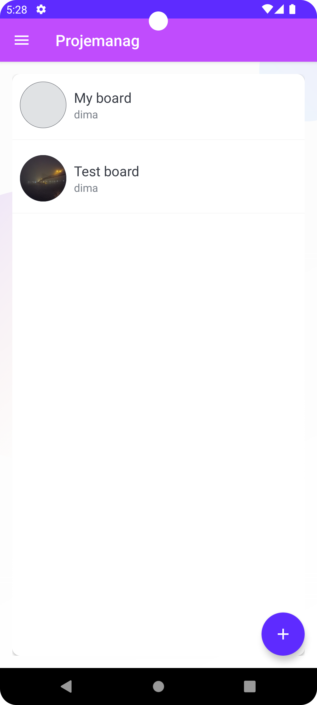
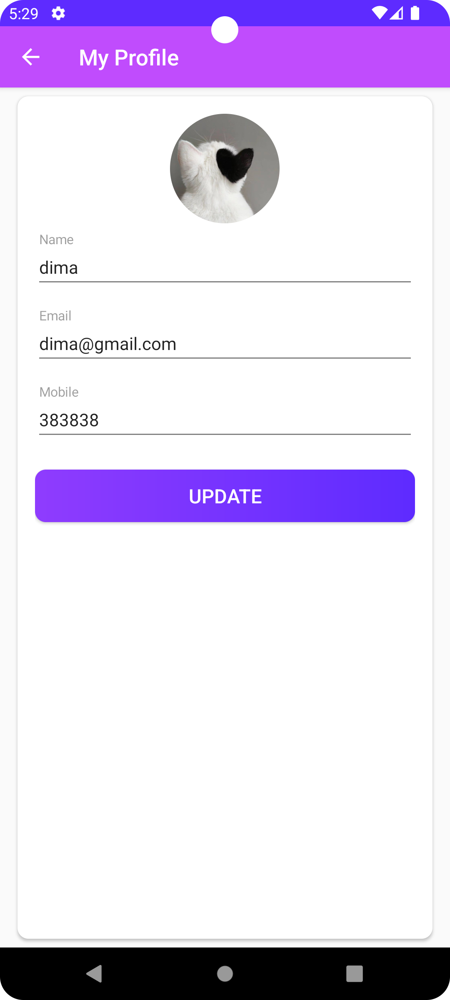
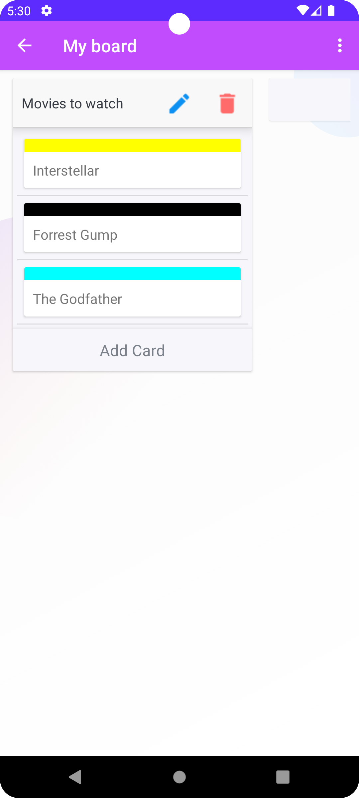
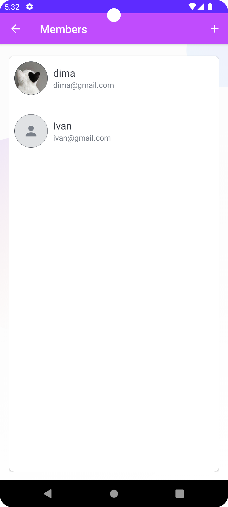

# Projemanag

Projemanag is an Android app for managing your tasks. User can create boards, tasks and subtasks and assign them to specific users for better collaboration. App uses Firebase, so data is synchronized across devices. 

## Technologies
* Kotlin
* XML
* Firebase SDK (Auth, Firestore, Storage)
* Jetpack Navigation
* Hilt
* Glide
* Coroutines
* View Model

## Functionality

1. **Main screen:**
   Displays the user's list of boards. Tapping on a board opens the associated task details.

   

      
   

2. **My profile:**
   Shows the user's profile information, including photo, name, email, and phone number. Users can update their profile picture by tapping the photo placeholder.

   

      
   

3. **Board info screen:**
   Displays tasks associated with the selected board. Includes a drag-and-drop feature for reordering subtasks within the task list. Tapping on a subtask opens the subtask details.

   

      
   

4. **Members screen:**
   Shows the list of members associated with the board. These members can be assigned to specific subtasks for better collaboration.

   

      
   

